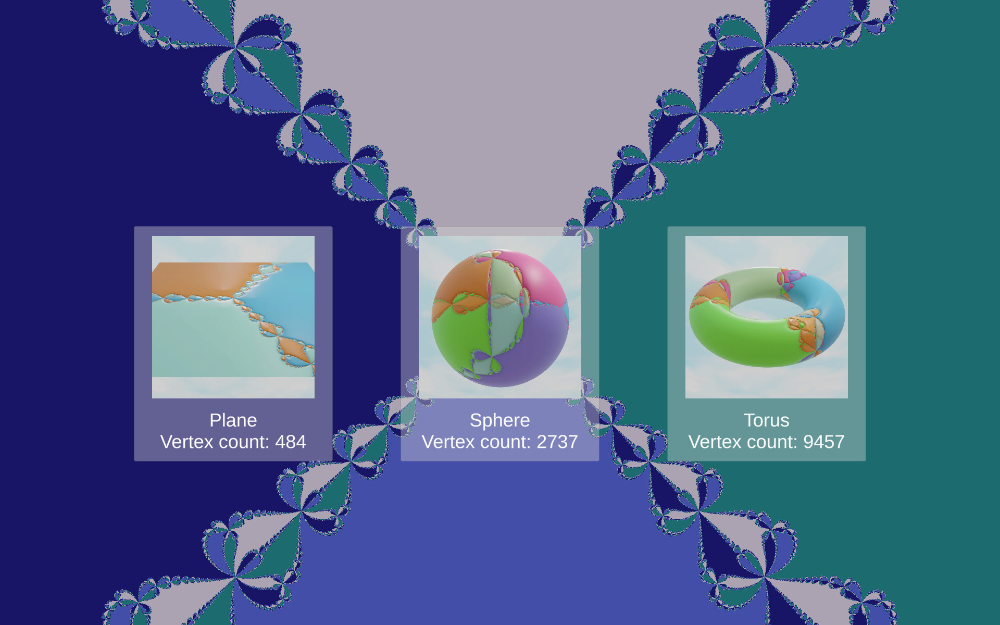
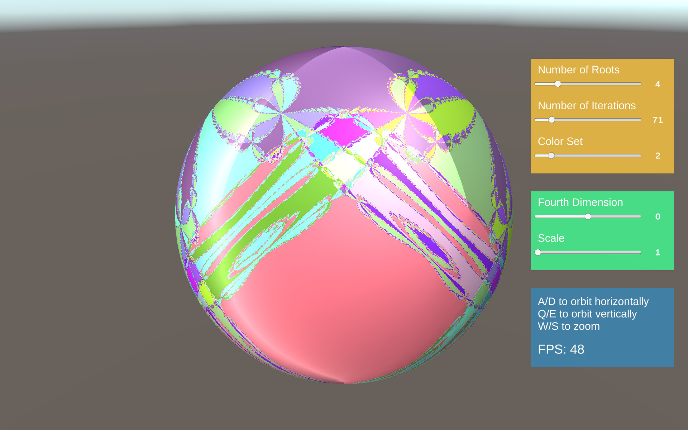

# Newton Fractals on Surfaces
This repository contains a Unity3D project implementing a demo for the method presented in [*Newton's Fractals on Surfaces via Bicomplex ALgebra*](https://dl.acm.org/doi/abs/10.1145/3532719.3543211), published at ACM SIGGRAPH 2022 in the Poster program.  

## Demo Content
The demo showcases a set of basic meshes with different vertex counts just for showing a proof of concept on different shapes and mesh densities.  

The scene can be navigated and a simple interface is offered to tune some parameters.

## Code
The core of the repository is a Unity3D Surface Shader located at `Assets/Shaders/NewtonShader.shader`.  
This shader implements the whole method and realizes a material that procedurally generates 4-dimensional Newton's fractals on any surfaces and runs in real time even on most low-end machines.